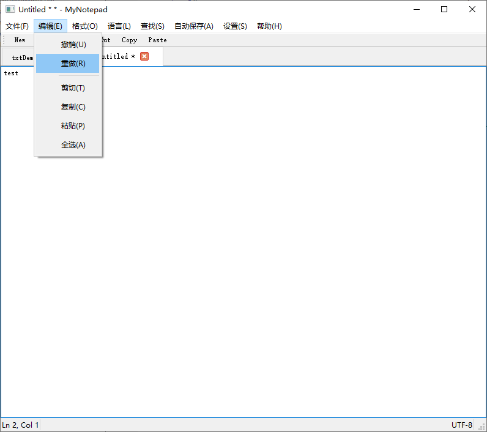

# 基于QT实现的记事本应用程序实验报告

## 1. 项目概述

本项目是一个基于Qt框架开发的现代化记事本应用程序，具有丰富的文本编辑功能和用户友好的界面。该应用程序不仅支持基本的文本编辑功能，还包含了**语法高亮**、**多标签页管理**、**自动保存**、**快捷键自定义**等高级特性。

## 2. 核心功能模块

### 2.1 项目架构图

#### 项目结构


#### 类关系图


### 2.2 主窗口模块 (MyNotepad)
主窗口类是整个应用程序的核心，负责协调各个功能模块的工作。主要功能包括：

- 文件操作：新建、打开、保存、另存为等
- 编辑操作：撤销、重做、剪切、复制、粘贴等
- 格式设置：字体、颜色等
- 查找和替换功能
- 多标签页管理
- 自动保存功能
- 快捷键自定义

### 2.3 标签页管理模块 (TabManager)
负责管理多个文本编辑标签页，主要功能：
- 创建新标签页
- 切换标签页
- 关闭标签页
- 保存标签页状态

### 2.4 语法高亮模块 (SyntaxHighlighter)
支持多种编程语言的语法高亮（目前支持`Java`、`C++`和`Python`）。
### 2.5 自动保存模块 (AutoSaveManager)
提供自动保存功能。
- 可配置自动保存间隔
- 自动保存文件到临时目录
- 程序启动时恢复未保存的内容

## 3. 技术实现要点

### 3.1 用户界面设计
```cpp
void MyNotepad::createMenus()
{
    // 文件菜单
    QMenu *fileMenu = menuBar()->addMenu(tr("文件(&F)"));
    QAction *newAction = fileMenu->addAction(tr("新建(&N)"), this, &MyNotepad::newFile);
    // ... 其他菜单项
    // 存储所有动作的映射
    actionMap["新建"] = newAction;
    // ... 其他操作项
}
```
- 使用Qt的菜单系统创建标准菜单栏
- 支持快捷键操作，将操作映射到`actionMap`上实现快捷键编辑与菜单动作解耦
- 提供工具栏快速访问常用功能

### 3.2 文件操作实现
```cpp
void MyNotepad::openFile()
{
    if (maybeSave()) {
        QString fileName = QFileDialog::getOpenFileName(this,
            tr("打开文件"), QString(),
            tr("文本文件 (*.txt);;所有文件 (*)"));
        // ... 文件打开逻辑
    }
}
```
- 使用Qt的文件对话框进行文件选择
- 支持多种文件格式
- 实现文件编码自动识别

### 3.3 多标签页管理
```cpp
void MyNotepad::setupConnections()
{
    connect(tabManager, &TabManager::currentTabChanged, this, &MyNotepad::onTabChanged);
    connect(tabManager, &TabManager::textChanged, this, &MyNotepad::onTextChanged);
}
```
- 使用信号槽机制实现标签页状态同步
- 支持标签页之间的切换
- 维护每个标签页的独立状态

### 3.4 自动保存机制
```cpp
void MyNotepad::toggleAutoSave()
{
    autoSaveManager->setAutoSaveEnabled(!autoSaveManager->isAutoSaveEnabled());
}
```
- 使用定时器实现定期保存
- 保存到临时文件
- 程序启动时自动恢复

### 3.4 全局异常捕获

```cpp
void customMessageHandler(QtMsgType type, const QMessageLogContext &context, const QString &msg)
{
    Q_UNUSED(context);  // 标记未使用的参数

    QString txt;
    switch (type) {
    case QtDebugMsg:
        txt = QString("Debug: %1").arg(msg);
        break;
    case QtInfoMsg:
        txt = QString("Info: %1").arg(msg);
        break;
    case QtWarningMsg:
        txt = QString("Warning: %1").arg(msg);
        break;
    case QtCriticalMsg:
        txt = QString("Critical: %1").arg(msg);
        break;
    case QtFatalMsg:
        txt = QString("Fatal: %1").arg(msg);
        break;
    }

    // 创建日志目录
    QDir dir;
    if (!dir.exists("logs")) {
        dir.mkdir("logs");
    }

    // 写入日志文件
    QFile outFile("logs/crash.log");
    outFile.open(QIODevice::WriteOnly | QIODevice::Append);
    QTextStream ts(&outFile);
    ts << QDateTime::currentDateTime().toString("yyyy-MM-dd hh:mm:ss") << " - " << txt << "\n";
    outFile.close();

    // 如果是致命错误，显示错误对话框
    if (type == QtFatalMsg) {
        QMessageBox::critical(nullptr, "程序错误",
            QString("程序发生严重错误：\n%1\n\n"
                   "错误已记录到日志文件：logs/crash.log\n"
                   "请将日志文件发送给开发人员以帮助解决问题。").arg(msg));
    }
}
```

- 注册全局异常处理函数并通过消息处理器将异常处理函数绑定到程序。

## 4. 项目特色

1. **模块化设计**：各个功能模块独立封装，便于维护和扩展
2. **用户友好**：提供丰富的快捷键和工具栏
3. **智能保存**：自动保存功能防止意外丢失
4. **多语言支持**：支持多种编程语言的语法高亮
5. **可定制性**：支持自定义快捷键和界面布局

## 5. 技术难点及解决方案

1. **文件编码处理**
   - 使用QTextCodec自动识别文件编码
   - 支持多种编码格式的读写

2. **多标签页管理**
   - 使用TabManager类统一管理标签页
   - 实现标签页状态的保存和恢复

3. **自动保存机制**
   - 使用定时器实现定期保存
   - 采用临时文件存储机制

4. **语法高亮实现**
   - 使用正则表达式匹配语法规则
   - 支持多种编程语言的语法规则

## 6. 运行效果图


<center>初始化窗口</center>


<center>多标签页编辑</center>


<center>字体格式设置</center>


<center>新建文件、保存</center>





<center>常用编辑操作</center>


<center>代码高亮</center>


<center>查找&替换</center>


<center>自动保存</center>


<center>快捷键自定义</center>


<center>About窗口</center>


<center>警告弹窗</center>

## 7. 未来改进方向

1. 添加更多编程语言的语法高亮支持
2. 实现文件比较功能
3. 添加代码折叠功能
4. 支持插件系统
5. 优化大文件处理性能

## 8. 总结

本项目实现了一个功能完善的现代化记事本应用程序，通过模块化设计和Qt框架的强大功能，实现了丰富的文本编辑功能。项目代码结构清晰，易于维护和扩展，为用户提供了良好的使用体验。 